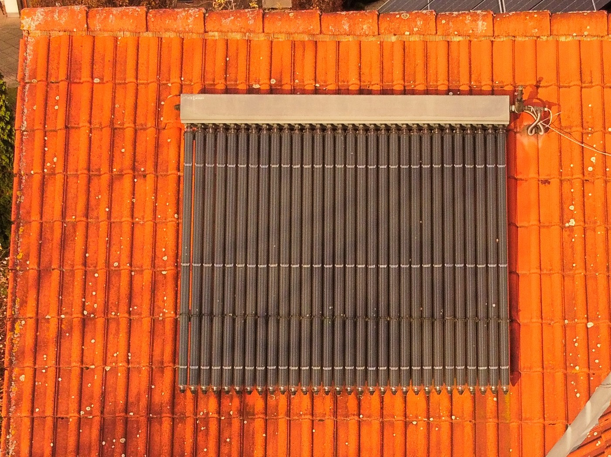
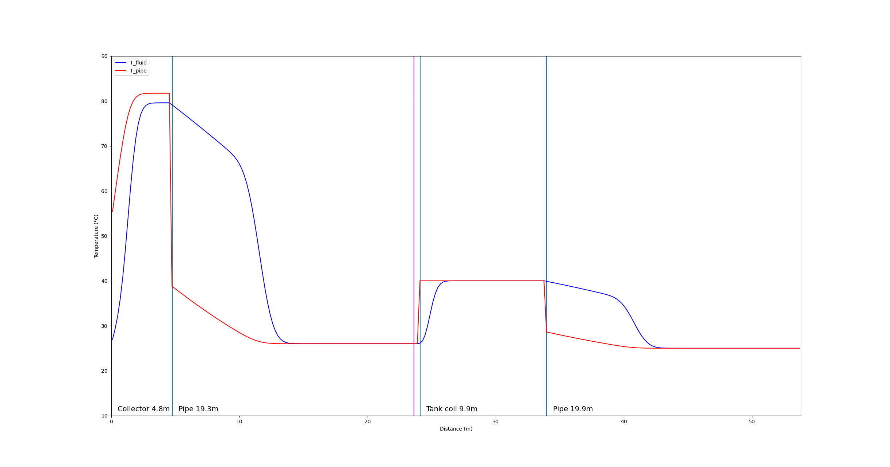
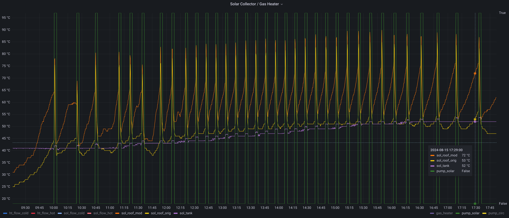
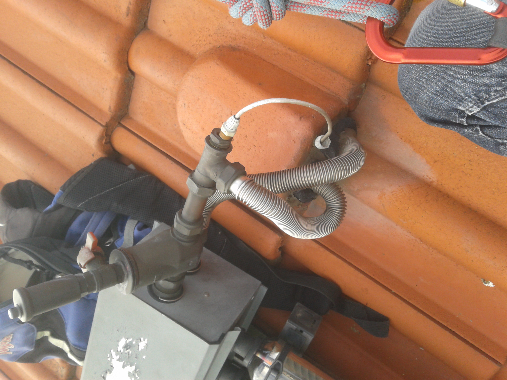
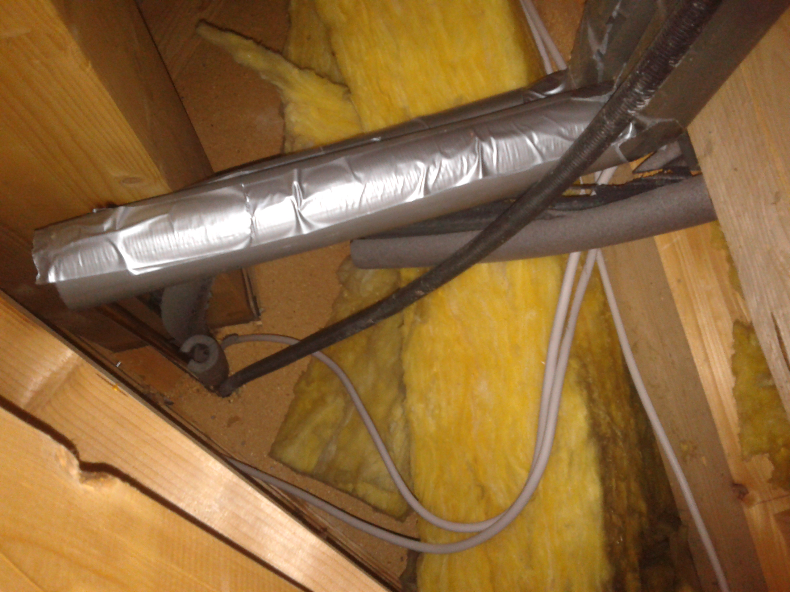

# Solarthermiekollektor
Seit dem Jahr 1998 ist ein 3 m² Solarthermie Vakuumröhrenkollektor zur Brauchwassererwärmung auf dem Süddach installiert.



Jedoch wurden nur an heißen und sonnigen Tagen brauchbare Erträge von meist ca. 45-48 °C im 300 Liter Warmwasserspeicher (Viessmann CeraCell-bivalent) erzielt.  
Die Anlage wurde seit dem Jahr 2013 parallel zum Bachelorstudium der Elektro- und Informationstechnik analysiert und folgende Probleme identifiziert:
* Das System hat nur zwei Temperatursensoren. Ein Sensor am Kollektor und ein Sensor im Warmwasserspeicher. 
* Die Rohrleitung bis zum Warmwasserspeicher in den Keller ist mit ca. 20 Metern sehr lang.
* Die Regelung "Viessmann Solartrol-E" kann mit einem Relais die Umwälzpumpe nur An- oder Abschalten. Die Drehzahl der Umwälzpumpe muss statisch über einen 3-Stufenschalter gewählt werden.
   * Die Regelung kann somit nicht auf variierende Einstrahlungsbedingungen eingehen, da keine dynamische Drehzahlregelung vorhanden ist.
   * Die Regelung ist nicht in der Lage, ein sicheres Einschwingen des Systems zu gewährleisten und es wurde oft beobachtet, wie kaltes Rücklaufwasser am Kollektorsensor nach weniger als einer Umwälzung direkt wieder zu einem Stopp geführt hat. Die heiße Sole gibt dann die Temperatur an einer beliebigen Stelle im Rohrnetz ab, anstatt das Brauchwasser im Speicher zu erwärmen.
* Der Entlüfter und die Rohre auf dem Dach sind nicht isoliert. [Siehe Foto: Fehlende Isolierung](#fehlende-isolierung)
* Der Temperatursensor am Kollektor ist zu weit vom Kollektor entfernt montiert.  [Siehe Foto: Schlechte Sensorposition](#schlechte-sensorposition)
* Die Rohrleitung zum Warmwasserspeicher ist nicht mit temperaturbeständigem Material isoliert. Heiße Sole hat die Isolation am Vorlauf zum Schmelzen gebracht. [Siehe Foto: Ungeeignetes Isolationsmaterial](#ungeeignetes-isolationsmaterial)


## Ertragsoptimierung

### V1: Parameteroptimierung der Viessmann Solartrol-E Regelung
Lediglich die Starttemperaturdifferenz vom Kollektorfühler und Speicherfühler (Standardwert: 8 Kelvin) sowie die Hysterese zum Abschalten (Standard: 50 %) können konfiguriert werden.  
Da der Kollektorfühler die tatsächliche Temperatur am Kollektorausgang bei Stillstand durch das unisolierte Rohrstück nicht korrekt erfassen kann, konnte das Anlaufverhalten mit einer Absenkung der Starttemperaturdifferenz auf 6K etwas verbessert werden. Nach dem Start steigt die Temperatur am Kollektorfühler dann kurzzeitig stark an, da die Sole im Inneren des Kollektors deutlich wärmer ist.  
Die 3-stufige Pumpe erzielte bei Stufe 1 die besten Erträge.  
Im August konnte mit den Einstellungen: Pumpe Stufe 1; Diff 6 K; Hys 78 % an einem heißen, sonnigen Tag eine Speichertemperatur von 52 °C erreicht werden. Bei Wolkendurchzug waren die Erträge deutlich geringer.  
Schnell war klar, dass mit einer Parameteroptimierung der Regelung oder eher Steuerung keine merkliche Verbesserung an Tagen mit Wolkendurchzug zu erzielen war. Auch ein Austausch der Sole brachte keine Verbesserung.

### V2: Eigene Regelung mit ATMega8 AVR Microcontroller und Solid-State-Relais 
Die beiden PT500 Temperatursensoren wurden mit dem integrierten Analog-Digital-Wandler des Microcontrollers ausgewertet. Zur Ansteuerung der Pumpe wurde ein Solid-State-Relais (SSR) des Typs S202S02 von Sharp genutzt. Ein SSR enthält einen TRIAC mit Optokoppler und kann im Gegensatz zu einem mechanischen Relais viele Schaltzyklen ohne Verschleiß ausführen. Das SSR sollte dazu genutzt werden, über eine Wellenpaketsteuerung die Drehzahl der Pumpe zu regeln. Dabei wird die 230 V Sinus-Wechselspannung für eine variable Anzahl an Perioden zu- und abgeschaltet. Über die mechanische Trägheit der Pumpe stellt sich somit eine geringere Drehzahl ein. Aufgrund von Mangel an Erfahrung mit diesem Verfahren und den ungesunden Geräuschen der Pumpe in diesem Betriebsmodus, wurde diese Idee 2015 zurückgestellt.

#### V2.1: Anbringung eines zusätzlichen Temperatursensors und Pumpen Mindesteinschaltzeit
Schnell war klar, dass auch mit eigener Regelung eine genaue Erfassung der Temperatur direkt am Kollektorausgang notwendig ist. Dazu wurde am 26.05.2015 ein kleiner PT500 Temperatursensor am Kollektorausgang angebracht. Auf dem [Kollektorfoto](#solarthermiekollektor) ist das Kabel für diesen Sensor zu sehen. Seit 10 Jahren arbeitet der Temperatursensor am provisorisch über das Dach gelegten Kabel problemlos. Der Microcontroller würde jedoch einen Ausfall erkennen und auf den originalen Sensor zurückschalten, der in der Tauchhülse sicherlich besser vor Umwelteinflüssen geschützt ist. Im Nachhinein hätte das gleiche Ergebnis wahrscheinlich auch durch eine Isolierung des Entlüfters und der Rohrelemente am Kollektor erzielt werden können.

Mit dem zusätzlichen Sensor kann präzise die tatsächliche Temperatur erfasst werden, die bei Stillstand der Pumpe auch über 20 Kelvin von der Temperatur des originalen Sensors abweichen kann. Die Einschaltbedingung wurde auf 25 Kelvin Temperaturdifferenz zum Speichersensor festgelegt. Mit der geschätzten Dauer eines halben Umlaufs der Sole wurde eine Mindestlaufzeit festgelegt. Damit sollte sichergestellt werden, dass jeder Pumpenstart einen Ertrag vom Dach in den Speicher transportiert und nicht nur umgewälzte kalte Sole den Speicher im worst-case sogar abkühlt. Falls nach der Mindestlaufzeit noch eine ausreichende Temperatur am Kollektorfühler vorhanden ist, wird der Pumpbetrieb fortgesetzt. Jedoch tritt dieser Betriebsmodus aufgrund von verrauschten Temperaturmesswerten selten ein. Mit dem Intervallbetrieb, der auch als Eimerprinzip bekannt ist, können an guten Tagen annähernd die Erträge des kontinuierlichen Betriebsmodus erreicht werden. An teilweise bewölkten Tagen, jedoch deutlich höhere Erträge.

#### V2.2: Optimierung der Mindesteinschaltzeit der Pumpe durch Modellbildung
Die bisher genutzte Laufzeit der Pumpe wurde durch Beobachtung der analogen Temperaturmessgeräte in der Solarstation gewählt. Da die Anlage aber die meiste Zeit im Intervallbetrieb und nicht im kontinuierlichen Betrieb läuft, soll die optimale Pumpenlaufzeit bestimmt werden. Dazu wurden alle Rohrlängen bestimmt und die Elemente des Solekreises modelliert. Genaueres findet sich im python Skript [soltherm.py](soltherm.py).

Zum Ausführen der Optimierung:
```
python3 soltherm.py
```
Die optimale Laufzeit (entweder maximaler Energieertrag pro Intervall oder maximale Arbeitszahl, bei der die elektr. Energie der Pumpe ins Verhältnis zur transportierten thermischen Energie gesetzt wird) kann dann im Microcontroller Programmcode eingesetzt werden.

Zum Ausführen der Simulation eines Pumpvorgangs mit z. B. 170 Sekunden Laufzeit:
```
python3 soltherm.py -p -t 170
```
In der folgenden Animation ist zu erkennen, wie die warme Sole vom Dach bis in den Rohrwärmetauscher im Wasserspeicher gepumpt wird.


Die vertikale violette Linie zeigt die Position eines zusätzlich installierten digitalen Temperatursensors (Maxim DS18B20 One-Wire), mit dem der Temperaturverlauf von Simulation und Realität verglichen werden kann. 

#### V2.3: Datenfusion
Durch das hohe Delta von 25 Kelvin für das "Eimerprinzip" wird viel Wärme beim Transport an die Rohre und Umgebung abgegeben. Ein kontinuierlicher Betrieb verspricht bei guten Einstrahlungsbedingung höhere Erträge. Das Ziel dieses Ansatzes ist es, der Solarregelung mit externen Daten die Entscheidung zu erleichtern, ob ein kontinuierlicher Betrieb der Pumpe lohnt. Als externe Daten kommen zum Beispiel Wetterdaten, Außentemperaturen, die Windgeschwindigkeit oder die aktuelle Leistung der Photovoltaikanlage als Alternative zu einem Einstrahlungssensor in Betracht.

Außerdem soll untersucht werden, ob die Einschaltbedingung von 25 Kelvin in Abhängigkeit der externen Bedingungen und der Speichertemperatur dynamisch angepasst werden sollte.

In der Solarstation im Keller, befindet sich neben der Umwälzpumpe versteckt unter der Isolierung eine Einstellmöglichkeit für den Durchfluss. Von außen sieht das Bauteil wie ein Durchflussmesser aus. Es handelt sich aber um ein Abgleichventil, auch als TacoSetter bekannt, der neben der Anzeige auch eine Stellschraube zur Einstellung des Durchflusses hat. Die Stellschraube steht auf Position 4 von 6. Hiermit könnte die der Durchfluss für einen kontinuierlichen Betrieb weiter abgesenkt werden. Alternativ könnte auch eine drehzahlgeregelte Pumpe eingebaut werden. Dazu wird aber entsprechendes Werkzeug zur anschließenden luftblasenfreien Befüllung des Solekreises benötigt.

Da der Kollektor zeitnah durch sechs zusätzliche Photovoltaikmodule auf dem Süddach in Kombination mit einer Wärmepumpe ersetzt wird, sind diese Ansätze noch nicht weiter verfolgt worden.


## Monitoring
Um das Systemverhalten in der Praxis zu untersuchen, gibt der Microcontroller alle drei Sekunden die Temperaturen per UART aus. Diese werden dann von einem ausgedienten Android Smartphone per UART-USB Wandler an der USB-OTG Schnittstelle eingelesen und in eine Zeitreihendatenbank (influxdb) gespeichert. Auf dem Android Smartphone läuft außerdem eine Grafana Instanz zur Visualisierung.
An guten Tagen ergibt sich ein Betrieb, der etwa folgendermaßen aussieht:


Die grüne Kurze zeigt den Intervallbetrieb der Umwälzpumpe.  
In der Abbildung ist auch die deutliche Temperaturabweichung des neu angebrachten Kollektorfühlers(orange) und des originalen Sensors(gelb) während des Pumpenstillstands zu erkennen.  
Die violette Kurve zeigt die Temperatur im Speicher und steigt im Tagesverlauf auf 52 °C.  
Mit der originalen Regelung und Parameteroptimierung konnten zwar auch 52 °C im Speicher erreicht werden, jedoch werden mit dem optimierten Intervallbetrieb an teilweise bewölkten Tagen deutlich höhere Erträge erzielt. Als Nebeneffekt wird zur Erreichung der 52 °C weniger Strom für die Pumpe aufgewendet als beim kontinuierlichen Betrieb. Zudem benötigt der Microcontroller der eigenen Regelung inkl. 5V-Netzteil und Android Smartphone nur ca. 1 W, während die Viessmann Regelung ca. 3 W aus dem 230 V Netz benötigt. Innerhalb der Pumpintervalle der Pumpe werden bei der eingestellten Stufe 1 zusätzlich 45 Watt benötigt.


## Problembilder

### Fehlende Isolierung


### Schlechte Sensorposition


### Ungeeignetes Isolationsmaterial


